# Styling audit: fossunited.org and the `fossunited` repo

**Date:** 18 September 2026
**Scope:** public website pages on <https://fossunited.org> (44 routes, captured at 1440px light, 1440px dark and 390px mobile, including the Frappe Builder and Web Page documents that exist only in the database; see Part 2) and the styling sources in this repository (`fossunited/public/css/custom.css`, `fossunited/templates/base.css`, `tailwind.config.js`, per-page CSS under `fossunited/www/`, Jinja templates and web templates, and the Vue dashboard's Tailwind config).
**Method:** every page was loaded in headless Chromium, screenshotted, and probed for computed styles (font families, heading sizes, button styles, backgrounds, container widths, card radii, `data-theme`, horizontal overflow, failed requests and console errors). Screenshots referenced below live in [`images/styling-audit-2026-09/`](images/styling-audit-2026-09/). The live `custom.css` was diffed against the repo copy: only the `.v3-action-*` block differs, so repo findings apply to production.

The dashboard at `/dashboard` requires a login and was audited from source only.

---

## Summary

The site is mid-migration between two visual systems and it shows on almost every axis that was measured.

| # | Finding | Severity |
|---|---------|----------|
| 1 | Two page generations coexist: white "legacy" pages and grey "v3" pages, with different fonts, backgrounds, containers and components | High |
| 2 | Dark mode only works on v3 pages. Legacy pages force light mode, so the theme flips while navigating. The toggle sits in a different place on every page | High |
| 3 | Maintainers May page ships a third palette (oklch, blue-tinted dark mode) | Medium |
| 4 | At least seven different primary-button styles are live | High |
| 5 | Brand green exists in five different values | Medium |
| 6 | No type scale: page-title sizes range from 24px to 88px, six pages have no `h1`, FOSS Hack has five, chapter pages render `h1`, `h2` and `h3` at the same size | Medium |
| 7 | Three nav bars and three footers | Medium |
| 8 | Card radius varies between 8, 10, 11, 12, 16 and 20px | Low |
| 9 | Mobile: horizontal scroll on four pages, no responsive heading scale | Medium |
| 10 | Four unconnected token systems (legacy `--clr-*`, `--v3-*`, FOSS Hack's own `--v3-*` redefinition, dashboard/frappe-ui) plus hard-coded hex in templates | High (root cause) |
| 11 | Code hygiene: 4,100-line `custom.css` with dead sections, `z-index: 999` on every button, broken font import on every page, duplicate icon stylesheets | Medium |
| 12 | Broken assets and error responses visible to users | Low |
| 13 | Links styled four different ways | Low |
| 14 | Database-only pages: four Frappe Builder pages are live with no site chrome, no theme, their own fonts and unfinished content; 14 Web Page documents carry their own inline styling | High |
| 15 | A Jinja macro leaks the literal text `{{ undefined value printed: parameter 'class' was not provided }}` into the `class` attribute on nine live pages | Medium |

Recommendations are at the end, ordered by effort.

---

## 1. Two page generations coexist

Pages fall into two families that share the nav and footer but nothing else.

| | Legacy pages | v3 pages |
|---|---|---|
| Body background | `#ffffff` (login: `#f3f3f3`) | `#f0f0f0` (`--v3-main-bg`) |
| Body font (computed) | `InterVariable` (from the Frappe website theme) | `Inter` (from `custom.css` import) |
| Layout | Bootstrap 4 `.container` (1290px) + inline Tailwind utilities | `.v3-container` (840px) or 1024px `.container` |
| Buttons | Tailwind `.btn` from `base.css`, or Bootstrap `.btn-primary` | `.v3-btn` |
| Dark mode | Never | Yes |
| Pages | Home, Blog, Team, City Communities, Industry Partners, Non-Profit, Code of Conduct, Privacy Policy, Login | Events, Grants, Grants Directory, Clubs, Jobs, event pages, chapter pages, Stack, Volunteers, Newsletter, Maintainers May, IndiaFOSS, FOSS Hack |

The home page and the events page are one click apart:

| Home (legacy, white, `InterVariable`) | Events (v3, grey, `Inter`) |
|---|---|
|  | 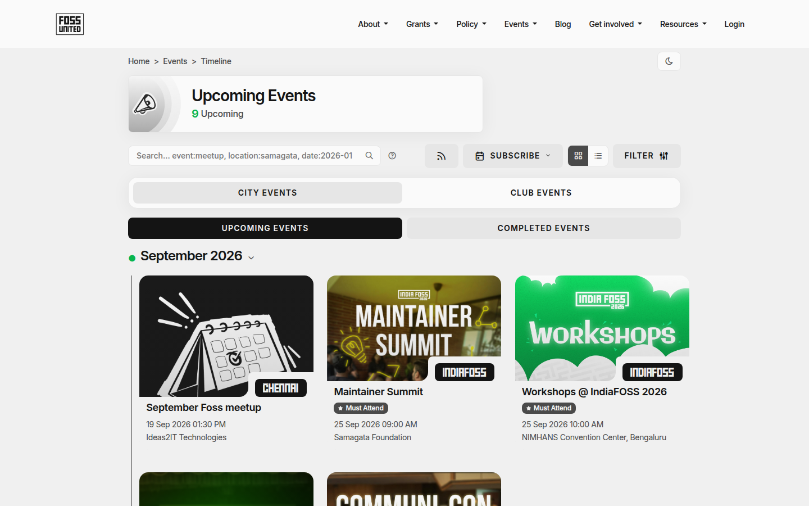 |

More legacy pages: [Team](https://fossunited.org/team), [City Communities](https://fossunited.org/city-communities), [Industry Partners](https://fossunited.org/industry-partners), [Code of Conduct](https://fossunited.org/code-of-conduct).

| Team | City Communities |
|---|---|
| 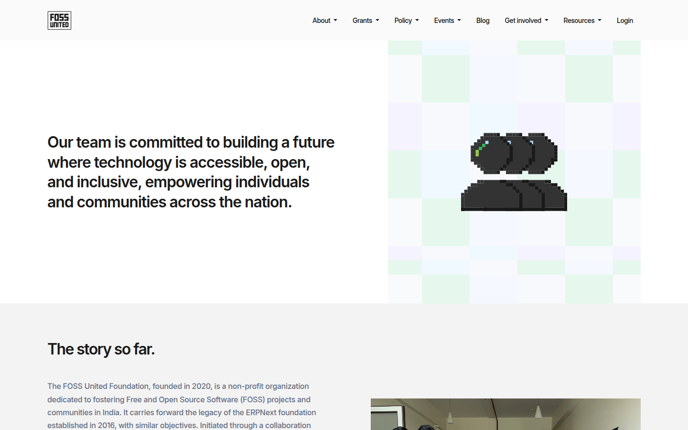 | 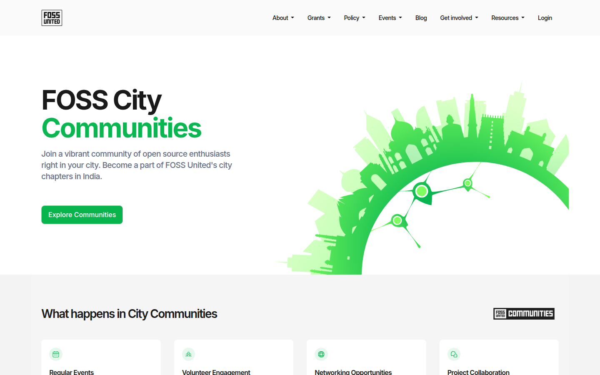 |

**Where it comes from in code**

- Legacy pages are mostly Frappe *Web Page* documents built from web templates in `fossunited/fossunited/web_template/` and `fossunited/chapters/web_template/` (for example `home_page___hero_and_about_section`, `team___hero_section`, `industry_partners_hero_section`). These use Tailwind utility classes compiled from [`fossunited/templates/base.css`](../../fossunited/templates/base.css) via the `build-tailwind` script in [`package.json`](../../package.json) and the `primary` palette in [`tailwind.config.js`](../../tailwind.config.js).
- v3 pages are `www/` and doctype templates that add the `v3-page` class and pick up the `--v3-*` variables in [`custom.css` lines 1649–1700](../../fossunited/public/css/custom.css#L1649).
- Both load on every page: the Frappe website theme CSS (Bootstrap 4 + `InterVariable`), then `custom.css` (which re-imports Inter under the family name `Inter`). `document.fonts` on every page lists both `InterVariable` and `Inter` as loaded fonts, so the site ships the same typeface twice under two names.

---

## 2. Dark mode is inconsistent and the toggle moves around

`localStorage.theme = 'dark'` was set before loading every page. Result:

| Page | `data-theme` after load | Body background |
|---|---|---|
| Events, Grants, Clubs, Jobs, event pages, chapters, Stack, Volunteers, Newsletter, IndiaFOSS, FOSS Hack | `dark` | `#141414` |
| Maintainers May | `dark` | `oklch(0.2461 0.0209 242.81)` (blue-tinted) |
| Home, Blog, Team, City Communities, Industry Partners, Non-Profit, Code of Conduct, Privacy, Login | `light` | `#ffffff` |

So a visitor in dark mode who clicks the logo from the events page lands on a white home page, and the login page is white too.

| Events in dark mode | Home with the same dark preference |
|---|---|
| 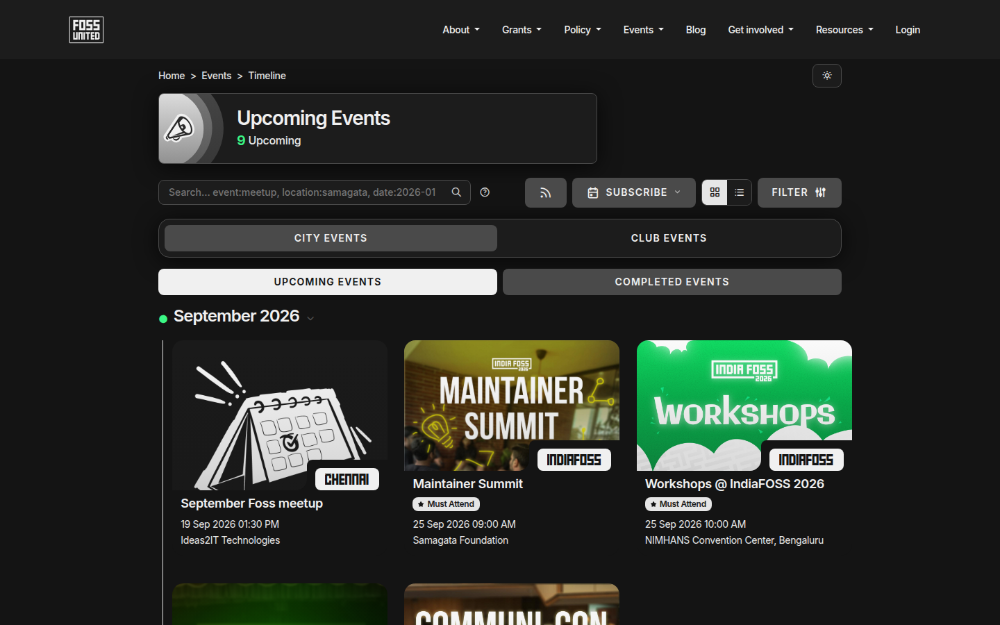 | 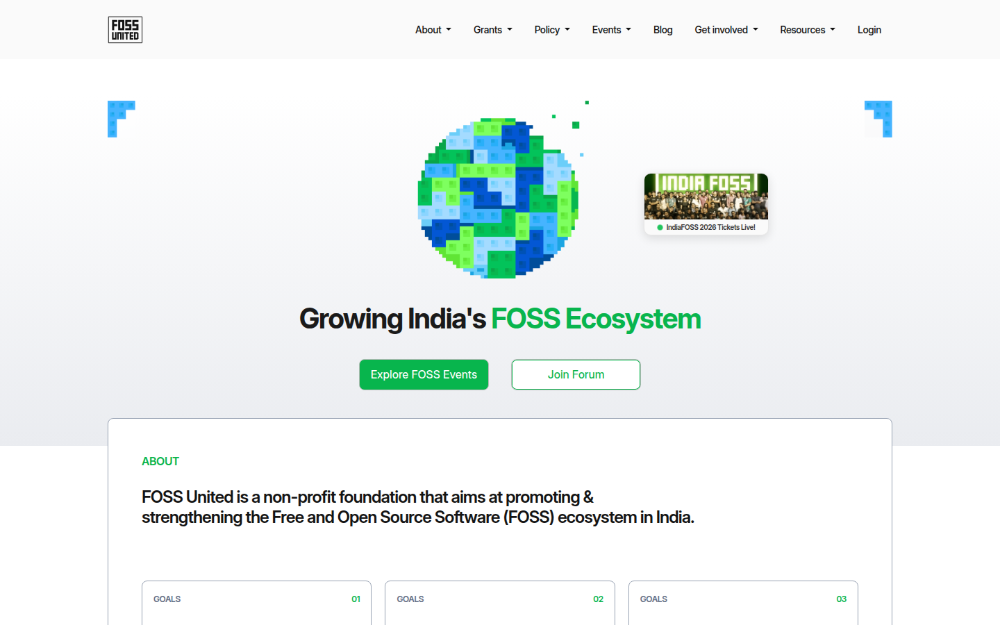 |

| Blog, dark preference | Login, dark preference |
|---|---|
| 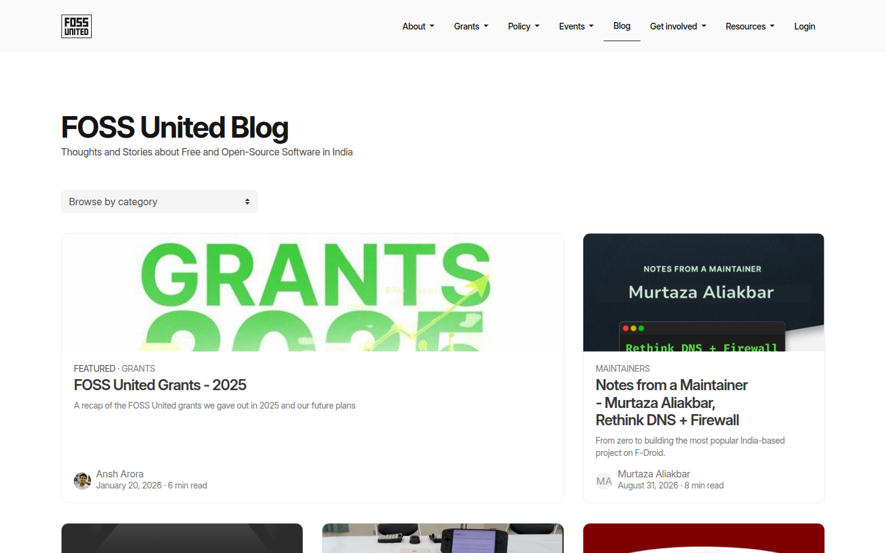 | 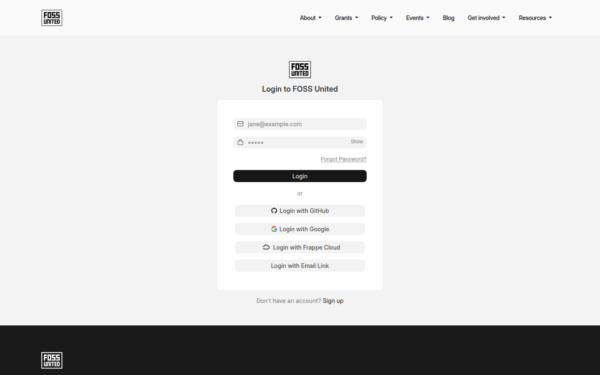 |

**Cause.** [`fossunited/public/js/common_functions.js` line 233–240](../../fossunited/public/js/common_functions.js#L233) only applies the saved theme if the page contains a `.theme-toggle` element, and otherwise **forces** `data-theme="light"`. The toggle is rendered by the breadcrumb macro, so any page without a breadcrumb (all legacy pages, the blog, login) is hard-locked to light. `foss_base.html` also has a pre-render script that sets the theme, but Web Page documents do not extend `foss_base.html`, so they never get it.

**Toggle placement.** Because the toggle lives in page content rather than the nav, it appears in a different spot on each page:

| Events: right of breadcrumb | Clubs: floating alone at top right | Jobs: next to an RSS button, lower |
|---|---|---|
| 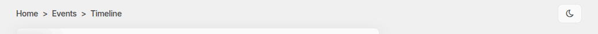 |  | 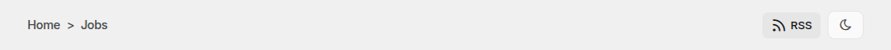 |

IndiaFOSS and FOSS Hack put it in their own nav bars instead (see finding 7). Legacy pages have no toggle at all.

---

## 3. Maintainers May uses a third palette

[`/maintainers-may`](https://fossunited.org/maintainers-may) is the only page whose computed colours come back as `oklch(...)`. Its light background is `oklch(0.9551 0 0)` rather than `#f0f0f0`, its headings are `oklch(0.2461 0.0209 242.81)` (a blue-black) rather than `#141414`, its buttons use `oklch(0.9219 0 0)`, and in dark mode the whole page, nav and footer turn blue-tinted while every other v3 page is neutral `#141414`. The hero illustration tiles also turn green in dark mode.

| Light | Dark (compare to the neutral dark of finding 2) |
|---|---|
| 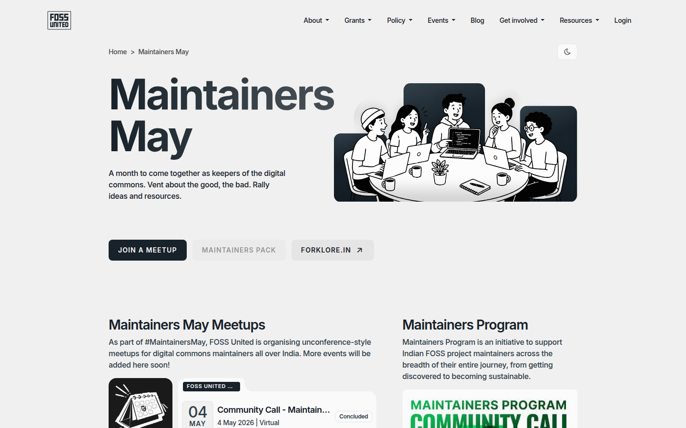 | 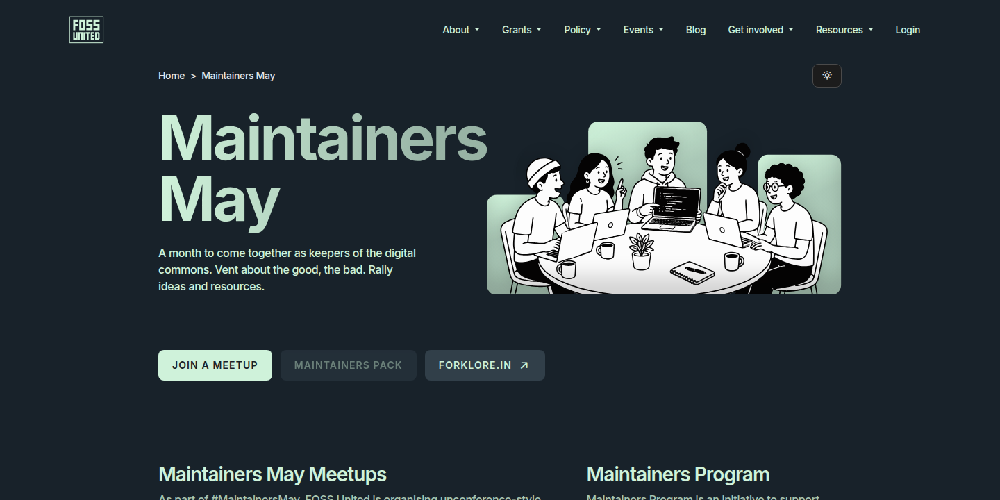 |

The values come from a page-specific `--m-*` palette at [`custom.css` line 3131](../../fossunited/public/css/custom.css#L3131) (`--m-bg`, `--m-card-bg`, `--m-text-1` and so on), used by `www/maintainers-may/index.html`. It is a fourth colour vocabulary in the same stylesheet and should be folded into `--v3-*`.

---

## 4. Seven primary-button styles

Computed styles of the main call-to-action button on each page:

| Page | Font | Size / weight | Case | Radius | Background | Source |
|---|---|---|---|---|---|---|
| Home, City Communities | Inter | 16px / 450 | none | 8px | `#08b54d` | Tailwind `.btn` in `base.css` |
| Industry Partners | Inter | **18px** / 450 | none | 8px | `#08b74f` | Tailwind utilities |
| Events, Grants, event pages, Volunteers | Inter | 14px / 600 | UPPERCASE, +0.07em | 8px | `#08b54d` | `.v3-btn` |
| Clubs | Inter | 14px / 600 | UPPERCASE | 8px | **`#1f2937`** (Tailwind gray-800) | Tailwind utilities on `www/clubs/index.html` |
| FOSS Hack | Inter | 16px / 420 | UPPERCASE | **0px** | `#141414` | `www/fosshack/2026/index.css` |
| Jobs | Inter | 13px / 500 | none | 6px | `#08b54d` | `.v3-btn--sm` |
| IndiaFOSS Speakers filters | Inter | 13px / 420 | none | 6px | `#141414` | page CSS |
| Login | InterVariable | 14px / 420 | none | 8px | `#171717` | Frappe `.btn-primary` |
| Maintainers May | Inter | 14px / 600 | UPPERCASE | 8px | `oklch(0.2461 …)` | Web Page inline |

| Home | Clubs | Industry Partners |
|---|---|---|
| 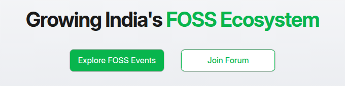 |  |  |

| FOSS Hack | Event page (v3) | Maintainers May |
|---|---|---|
| 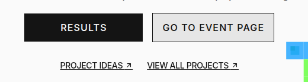 | 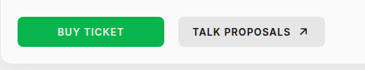 | 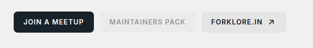 |

Secondary buttons diverge the same way: outlined green (home), Tailwind gray-200 (clubs), `#e6e6e6` pill (v3), bordered square (FOSS Hack), white (IndiaFOSS hero).

**In code**, three button systems are defined:

- [`base.css` lines 26–37](../../fossunited/templates/base.css#L26): Tailwind `.btn`, `.btn-solid`, `.btn-subtle` using `!px-5 !py-3` important overrides to beat Bootstrap's `.btn`.
- [`custom.css` line 1781](../../fossunited/public/css/custom.css#L1781): `.v3-btn` and variants.
- Bootstrap `.btn-primary` / `.btn-secondary` from the Frappe website theme, used 29 and 56 times respectively in templates (`grep -c btn-secondary`).

Clubs is the clearest case of the wrong palette: `www/clubs/index.html` uses `bg-gray-800` / `bg-gray-200`, which resolve to Tailwind's blue-tinted greys (`#1f2937`, `#e5e7eb`) instead of the neutral `#141414` / `#e6e6e6` used everywhere else.

---

## 5. Five values of brand green

| Value | Where |
|---|---|
| `#08b74f` | `tailwind.config.js` `primary.DEFAULT`; 14 hard-coded uses in templates; Industry Partners heading and button |
| `hsla(144, 92%, 37%)` = `#08b54d` | `custom.css` `--v3-primary-button` and `--clr-foss-mint-500`; every v3 button |
| `hsla(144, 92%, 60%)` | `--v3-primary-button` in dark mode |
| `#30a66d` | Frappe theme `--green-600`, used for Bootstrap link/success colours |
| `#4ba306`, `#2e7d32`, `#e8f5e9` | `custom.css` (3 uses) and templates (Material greens for status badges) |

The 2-unit difference between `#08b74f` and `#08b54d` is invisible alone but means two sources of truth. The dark-mode green (`60%` lightness) has no counterpart in the Tailwind config, so any Tailwind-styled component stays `#08b74f` in dark mode.

---

## 6. No typographic scale

Computed `h1` size on the page title at 1440px:

| Page | h1 | Notes |
|---|---|---|
| Stack | 24px | |
| Events, Grants, Grants Directory | 28px | |
| Event pages, chapter pages, Volunteers | 32px | Chapter page renders `h1`, `h2` **and** `h3` all at 32px |
| FOSS Hack, IndiaFOSS Speakers | 40px | FOSS Hack has **five** `h1` elements |
| Blog | 48px | |
| Clubs | 60px | |
| City Communities, Industry Partners | 64px | |
| IndiaFOSS | 72px (sr-only) | |
| Maintainers May | 88px | |
| Home, Jobs, Team, Code of Conduct, Privacy, Non-Profit, Login | **none** | Jobs uses a 56px `h2`, Code of Conduct a 40px `h2` |

Weight also alternates between 600 and 700 for titles of the same rank, and letter-spacing between `-0.02em` and `-0.04em`.

`custom.css` defines a full size scale (`--text-xs` … `--text-8xl`, lines 20–32) and weight scale (`--fw-*`), but neither is referenced by the v3 rules, which use literal `rem` values.

---

## 7. Three nav bars, three footers

| Standard (85px, `#fafafa`, Bootstrap dropdowns) | IndiaFOSS (60px, transparent, own toggle + CTA) | FOSS Hack (66px, boxed, own toggle) |
|---|---|---|
|  |  | 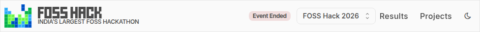 |

| Standard footer (`#1a1a1a`) | IndiaFOSS footer (`#141414`, different columns) | FOSS Hack footer (minimal) |
|---|---|---|
| 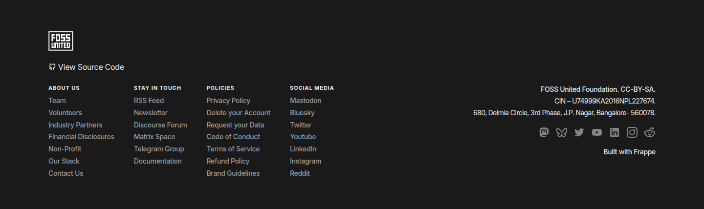 | 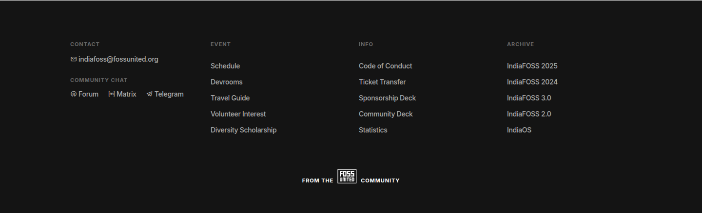 |  |

Event microsites having their own chrome is defensible, but the dark-mode toggle, the "back to FOSS United" affordance and the footer legal links should be shared components. The standard footer background `#1a1a1a` also does not match the dark-mode page background `#141414`, so in dark mode there is a visible seam between page and footer.

The Tabler icon font is linked from ten different templates: [`foss_base.html`](../../fossunited/templates/foss_base.html#L11) and four web templates pin `@latest`, while the footer web template and four home-page section web templates pin `2.46.0`. The live home page ends up with three copies of the same stylesheet.

---

## 8. Card radii

Counts of distinct `border-radius` on elements whose class contains `card`, per page:

| Page | Radii in use |
|---|---|
| Home | 8px, 16px, 20px, `8px 0 0` |
| Blog | 12px, `11px 11px 0 0` |
| Team, Clubs | 12px |
| City Communities | 8px |
| Login | 10px |
| v3 pages (Grants, Jobs, Stack, event pages) | 16px |
| Chapter page | 8, 12, 16, 20px on the same page |

`.v3-card` (16px, `custom.css` line 1726) is the intended standard.

---

## 9. Mobile

**Horizontal scroll** (document wider than the 390px viewport):

| Page | Scroll width | Overflowing element |
|---|---|---|
| [Grants Directory](https://fossunited.org/grants/directory) | 414px | `.v3-btn.v3-btn-secondary` in the header button group |
| [Events](https://fossunited.org/events/timeline) | 397px | `.row.v3-timeline-grid` (Bootstrap `.row` negative margin with no padded parent) |
| [Stack](https://fossunited.org/stack) | 397px | `.row` around the category cards |
| [Maintainers May](https://fossunited.org/maintainers-may) | 397px | `.row` in the hero |

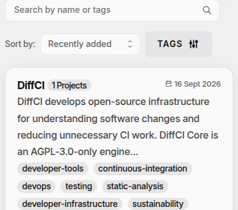

**Headings do not scale down.** Jobs keeps its 56px title on a 390px screen, Maintainers May 56px, Blog 48px, Industry Partners 48px. v3 titles (28–32px) are fine.

| Jobs mobile | Events mobile | Home mobile |
|---|---|---|
| 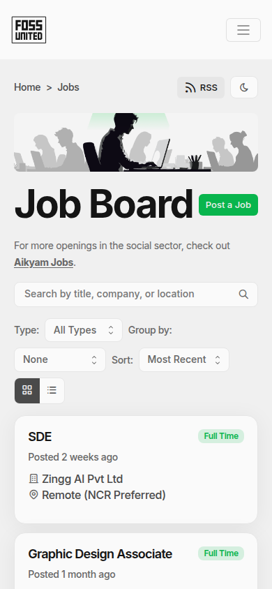 | 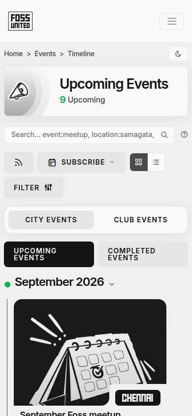 | 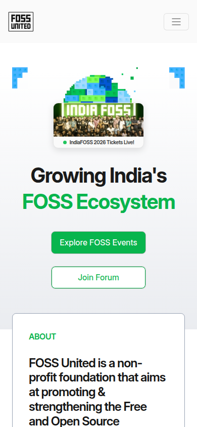 |

On the events page the two segmented controls stack awkwardly and the "Upcoming events" label wraps onto two lines inside a pill.

---

## 10. Root cause: four unconnected token systems

1. **Legacy tokens**, [`custom.css` lines 16–128](../../fossunited/public/css/custom.css#L16): `--clr-gray-*`, `--clr-foss-mint-*`, `--clr-libre-white-*`, `--clr-open-gray-*`, `--clr-code-night-*`, `--clr-error-*`, a type scale and weight scale. Stored as bare HSL triplets. Barely referenced by the rest of the file.
2. **v3 tokens**, [`custom.css` lines 1654–1693](../../fossunited/public/css/custom.css#L1654): `--v3-card-bg`, `--v3-main-bg`, `--v3-text-color`, `--v3-primary-button` and so on, with a dark-mode block. This is the healthiest set.
3. **FOSS Hack's own copy**, [`www/fosshack/2026/index.css` lines 2–25](../../fossunited/www/fosshack/2026/index.css#L2): redeclares `--v3-*` with *different names* (`--v3-border`, `--v3-text`, `--v3-green`) and *different values* (dark card background `17%` instead of `11%`). Because it targets `:root`, it also overrides the shared `--v3-card-bg` on that page.
4. **Dashboard**, [`dashboard/tailwind.config.js`](../../dashboard/tailwind.config.js): frappe-ui preset plus a well-documented `--color-ink-*` / `--color-surface*` / `--color-status-*` set. None of these names or values are shared with the website, so a user moving from `/c/mumbai/2026` to `/dashboard` sees different greys, borders and green.
5. **Tailwind config for the website**, [`tailwind.config.js`](../../tailwind.config.js): a `primary` palette (`#08b74f`) that differs from `--v3-primary-button`, and no dark-mode mapping.

On top of these, templates carry **hard-coded hex colours**: 13 uses of `#667085` and `#1a1a1a`, 14 of `#08b74f`, plus Material-palette values (`#2e7d32`, `#1565c0`, `#e65100`, `#9c27b0`) in badge templates. The busiest files are `foss_communities___list.html` (12), `foss_clubs_home_page.html` (11) and `fosshack/2026/index.html` (8). Inline `style=""` attributes: 34 on `indiafoss/2026/index.html`, 31 on `fosshack/2026/index.html`, 28 on the hackathon localhost template.

---

## 11. Code hygiene

- [`custom.css`](../../fossunited/public/css/custom.css) is 4,143 lines and contains its own removal notes: line 930 "TODO: Remove with v3 timeline design", line 1196 "FIXME: Can be removed since v3 events page changed", line 3013 "TODO: Replace .events-grid-4, .members-grid-6". A PurgeCSS config exists but must safelist most of Bootstrap and all `v3-` classes, which limits what it can remove.
- [`.v3-btn` sets `z-index: 999`](../../fossunited/public/css/custom.css#L1804). Every button on v3 pages sits above dropdown menus, sticky headers and most overlays that use a lower value. This is a latent stacking bug.
- The Frappe website theme CSS starts with `@import "frappe/public/css/fonts/inter/inter.css"`, a relative path that resolves to `/files/website_theme/frappe/public/css/fonts/inter/inter.css` and returns HTML. **Every page logs a console error** ("Refused to apply style… MIME type text/html"). `custom.css` line 1 works around it by importing the font a second time under a different family name, which is why finding 1 shows two Inter families.
- Space Mono and Fira Code are pulled from Google Fonts in `base.css` while Inter is self-hosted; the FFF Forward `@font-face` is declared twice (`custom.css` line 5 and `base.css` line 9).
- `foss_base.html` loads Tabler icons from `@latest`, so a CDN release can change icon glyphs without a deploy.
- `.btn` in `base.css` uses `!px-5 !py-3 !text-sm` (Tailwind important modifiers) to fight Bootstrap's `.btn`, and `.v3-btn` fights it again with `background-image: none; appearance: none`. Three systems overriding each other is why buttons drift.

---

## 12. Broken assets and error responses

| Page | Problem |
|---|---|
| [Workshops @ IndiaFOSS](https://fossunited.org/c/indiafoss/2026/workshops) | `403` on `/private/files/point-blank-black.svg` (a sponsor logo uploaded as a private file) |
| [IndiaFOSS 2026](https://fossunited.org/indiafoss/2026) | A background fetch to `/` returns `502 Bad Gateway` |
| [/hackathon/projects](https://fossunited.org/hackathon/projects) | Returns `403` to anonymous visitors but is linked from FOSS Hack ("View all projects") |
| All pages | Website-theme font import fails (finding 11) |

---

## 13. Links

Prose links are styled four ways: green with no underline on Home and Team (`#08b54d`), dark grey with underline on v3 pages, `#7c7c7c` with no underline on the blog, and `#383838` underlined on Code of Conduct. `custom.css` line 241 explicitly adds underlines for WCAG 1.4.1 on v3 pages, but the rule does not reach legacy pages.

---

# Part 2: pages that exist only in the database

The sitemap lists 36,031 URLs. After removing user profiles (`/u/*`, 30,666), chapter and event routes (`/c/*`), hackathon projects (`/hack/*/p/*`) and blog posts, 38 routes remained that are not rendered by a template in this repo. Each was fetched and classified by the markers Frappe leaves in the HTML (`data-doctype="Web Page"` with `source-content-type`, the `__builder` marker of Frappe Builder, or the `v3-page` class of repo templates).

| Route | Rendered by | Notes |
|---|---|---|
| `/landing` | **Frappe Builder** | Alternative home page. JetBrains Mono, monochrome, own nav |
| `/seeduler` | **Frappe Builder** | "Live Scheduler" prototype, raw ISO timestamps, 1122px wide on mobile |
| `/pages/indiafoss-backup` | **Frappe Builder** | Full copy of the IndiaFOSS 2025 site, still published |
| `/pages/page-8076455c` | **Frappe Builder** | Untitled "My Page" scheduler prototype with placeholder "Text" |
| `/pages/my-page-3d93` | Frappe Builder (403) | Unpublished, but listed in the sitemap |
| `/home` (also `/`) | Web Page, Page Builder | Home page |
| `/team`, `/city-communities`, `/industry-partners`, `/code-of-conduct`, `/privacy-policy`, `/public-policy`, `/refund-transfer-policy`, `/daily`, `/join`, `/events` | Web Page, Page Builder | Built from the web templates in `fossunited/fossunited/web_template/` |
| `/stack`, `/volunteers`, `/first-commit` | Web Page, Page Builder | Same, but the web template outputs v3 markup |
| `/non-profit`, `/terms-of-service` | Web Page, Markdown | |
| `/newsletter`, `/timeline`, `/landing-1`, `/fh24/partner-projects` (+2 sub-pages) | Web Page, raw HTML | HTML pasted into the document |
| `/contact` | Web Form | Frappe's default web-form styling |
| `/get-tickets` | 403 | Listed in the sitemap, not permitted |
| `/about` | 301 to `/team` | |

The `/events` route is a Web Page, while `/events/timeline` is the repo template. Both are linked from the nav.

## 14. Frappe Builder pages

The four live Builder pages do not load the website theme or `custom.css`. They load Builder's `reset.css`, `/builder_assets/tokens.css` and a per-page generated stylesheet, so nothing in this repo applies to them: no nav, no footer, no `data-theme` attribute (dark mode preference is ignored entirely), no Inter from the site's font pipeline.

| `/landing` | `/seeduler` |
|---|---|
| 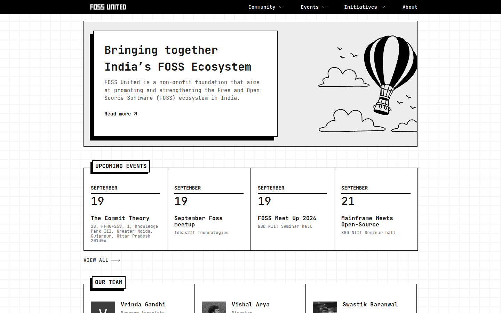 | 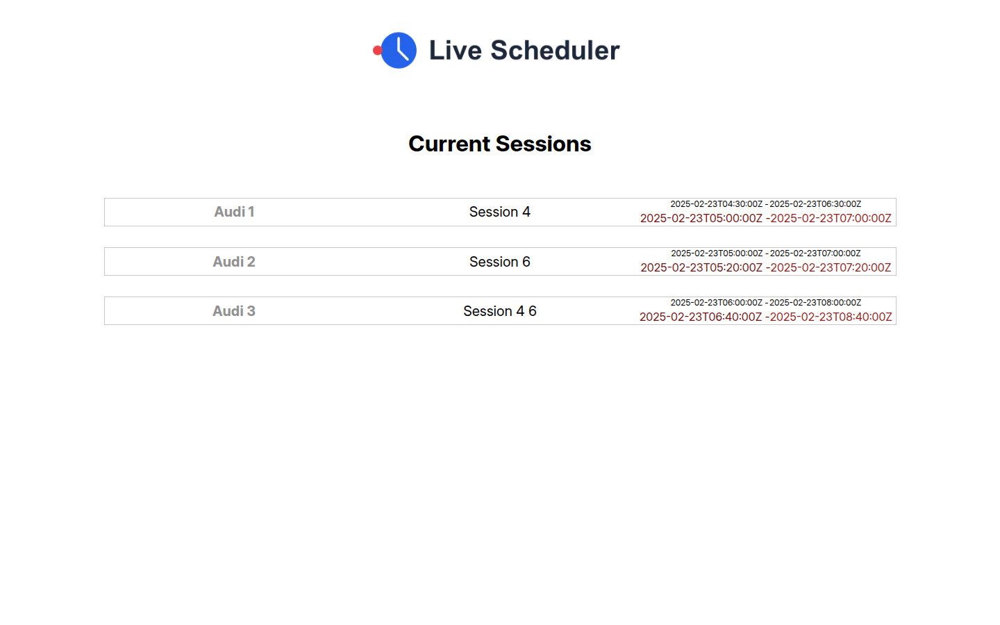 |

| `/pages/indiafoss-backup` | `/pages/page-8076455c` |
|---|---|
| 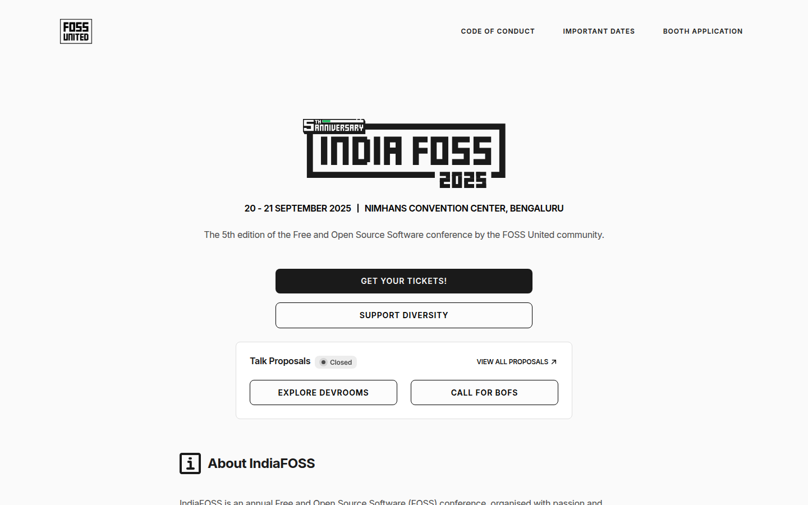 | 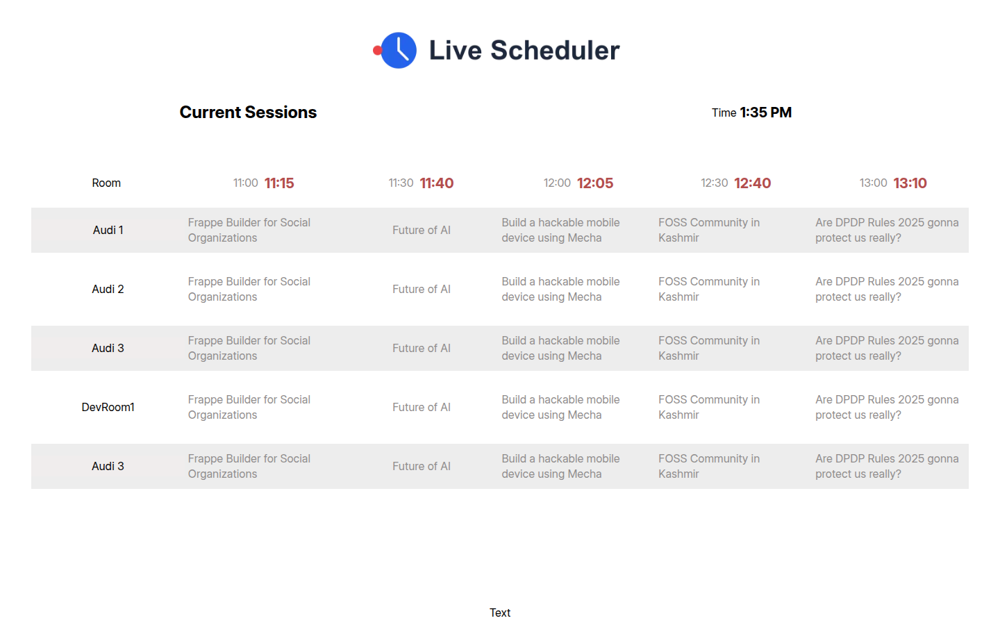 |

Specific problems:

- **[`/landing`](https://fossunited.org/landing)** is a complete alternative home page in JetBrains Mono (loaded from Google Fonts) with a black nav ("Community / Events / Initiatives / About") that does not match the real nav, hard-coded greys (`#ededed`, `#171717`, `#7c7c7c`) and three broken images (404 on `belpy.png`, `MAC_talk_wednesday_solutions.jpg` and a file whose name is a full sentence). It is publicly reachable and indexed via the sitemap.
- **[`/seeduler`](https://fossunited.org/seeduler)** and **[`/pages/page-8076455c`](https://fossunited.org/pages/page-8076455c)** are two versions of a "Live Scheduler" prototype. One shows raw `2025-02-23T04:30:00Z` timestamps in red, the other has a literal placeholder block reading "Text" at the bottom and rows of duplicated dummy sessions. The first renders 1122px wide on a 390px phone.
- **[`/pages/indiafoss-backup`](https://fossunited.org/pages/indiafoss-backup)** is a full copy of the 2025 IndiaFOSS site with its own nav ("Code of Conduct / Important Dates / Booth Application"), loads Inter twice from Google Fonts under the names `Inter` and `inter`, and requests a missing `/pages/profile_photo`.
- All four fire a `417` on Frappe's page-view logging endpoint on every load.

| `/landing` on mobile | `/seeduler` on mobile (page is 1122px wide) |
|---|---|
| 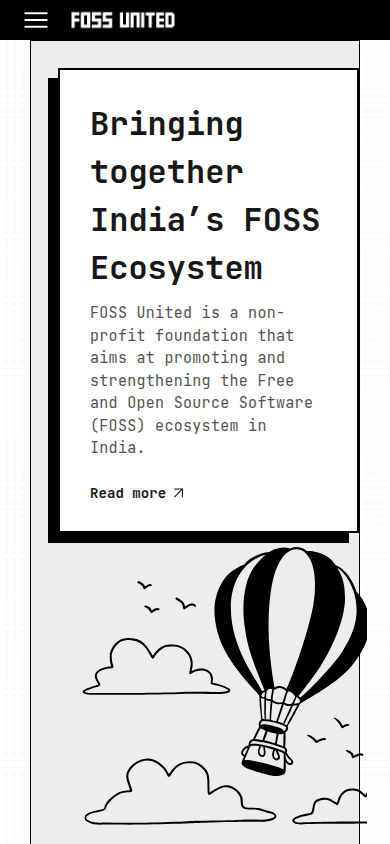 | 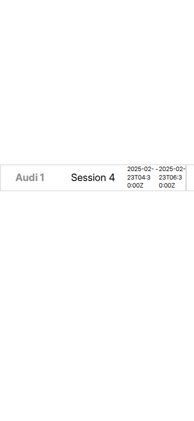 |

Builder pages cannot be enumerated from outside without a login. The four above are the ones the sitemap exposes, so there may be more that are published but not in the sitemap.

## 15. Web Page documents

These pages do get the nav, footer and `custom.css`, but their content is authored in the Frappe desk, so their styling cannot be reviewed or changed through this repo.

| `/events` (Web Page) vs `/events/timeline` (repo template) | `/public-policy` |
|---|---|
| 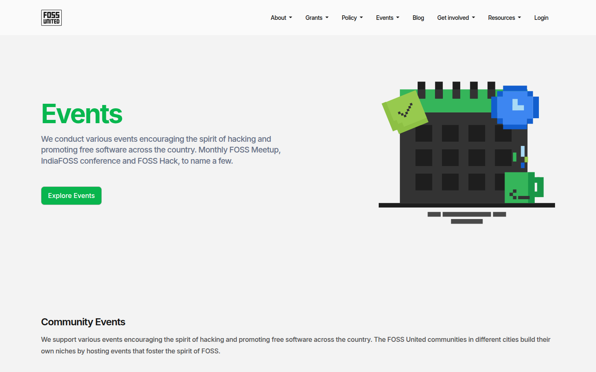 | 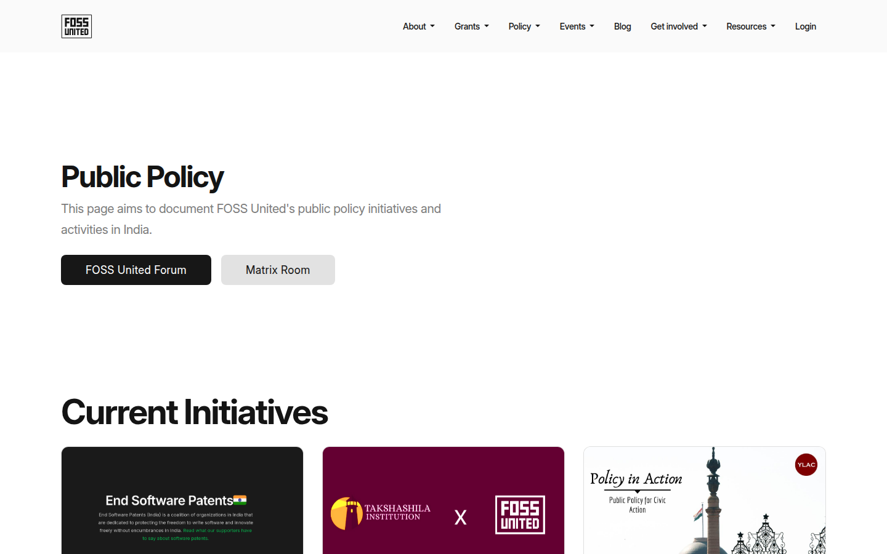 |

| `/daily` | `/join` |
|---|---|
| 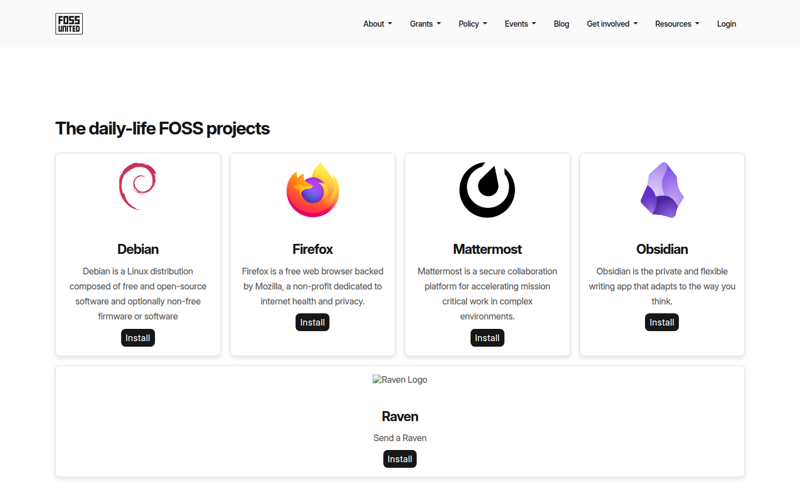 | 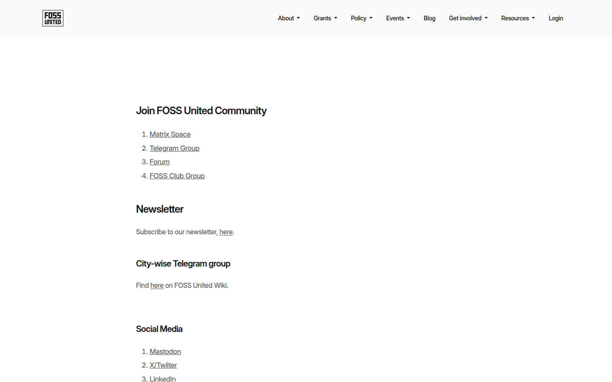 |

| `/contact` (Web Form) | `/fh24/partner-projects` |
|---|---|
| 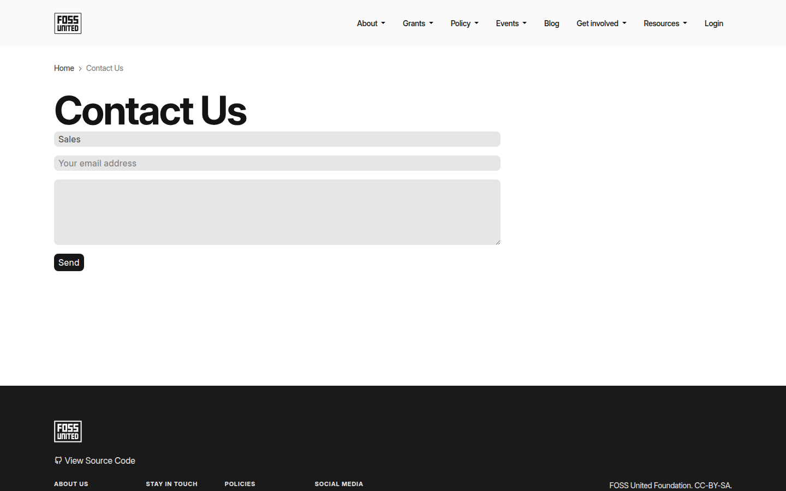 | 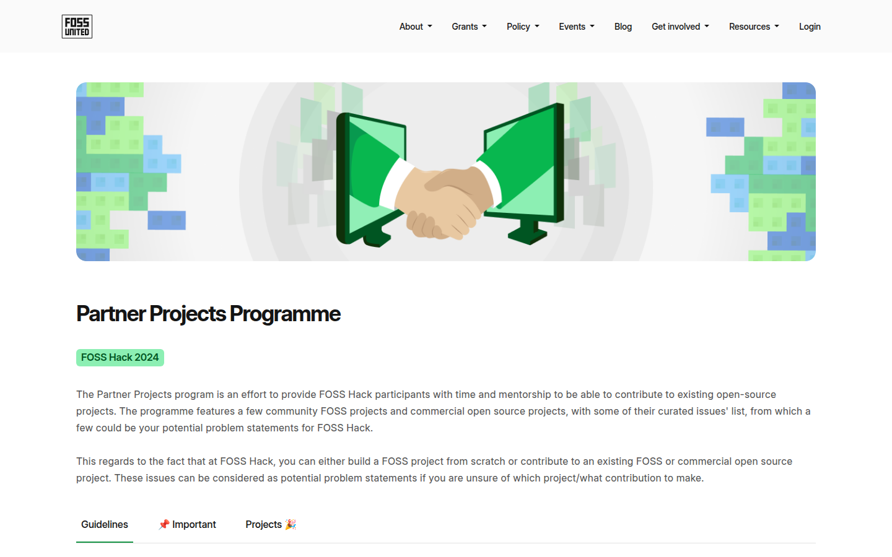 |

Findings:

- **Two "events" pages.** [`/events`](https://fossunited.org/events) is a white legacy Web Page with a 64px green title and Tailwind buttons; [`/events/timeline`](https://fossunited.org/events/timeline) is the grey v3 listing. The nav's "Events" dropdown links to both.
- **[`/landing-1`](https://fossunited.org/landing-1)** is a raw-HTML Web Page titled "Landing Trial-1": a design prototype with Source Serif 4 from Google Fonts, an `oklch` background, its own nav, on-page controls for switching between variants ("Rounded / Boxy", "Text-first / Split photo / Ticker") and an "I'm Lost" floating button. It is live, indexed, and 423px wide on mobile.

  | Desktop | Mobile |
  |---|---|
  | 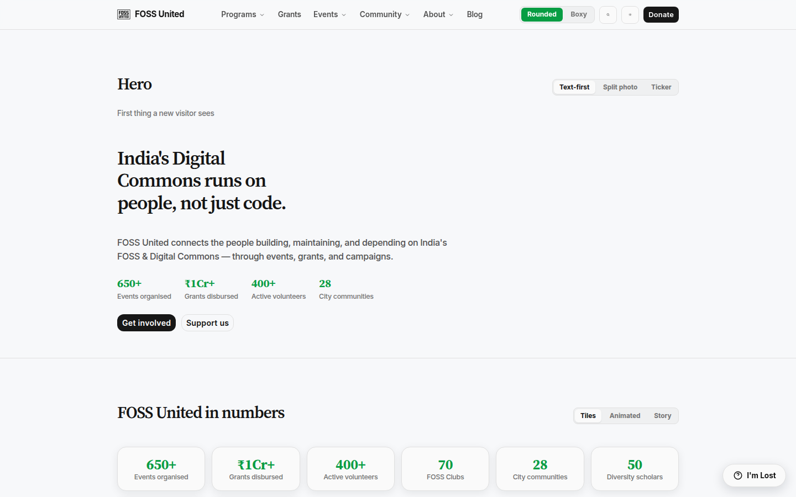 | 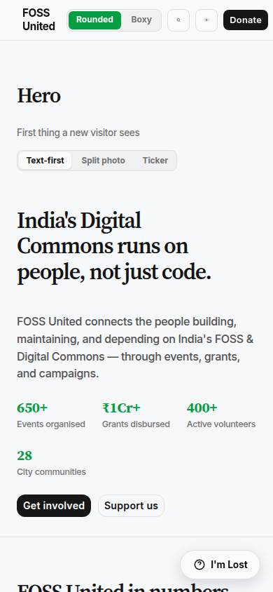 |

- **[`/timeline`](https://fossunited.org/timeline)** is a raw-HTML Web Page that embeds a copy of the events timeline. It renders the site nav **twice** (a second "Home / Login" bar under the real one), loads the theme CSS and `custom.css` twice, uses a different placeholder illustration from `/events/timeline`, and requests `/{{ footer_logo }}` because an un-rendered Jinja expression was pasted into the HTML.

  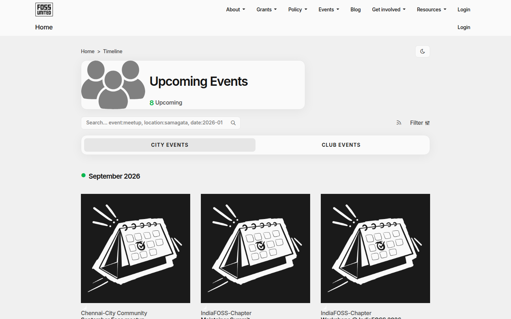

- **[`/contact`](https://fossunited.org/contact)** is a stock Frappe Web Form: 72px `h1`, grey Bootstrap inputs and a small black "Send" button. None of it matches either site generation.
- **[`/daily`](https://fossunited.org/daily)** has a broken "Raven Logo" image and uses white cards with 8px radius and Frappe's `.btn-primary` rather than v3 cards and buttons.
- **[`/join`](https://fossunited.org/join)** and **[`/public-policy`](https://fossunited.org/public-policy)** have no `h1` (`/public-policy` has a 48px `h1` followed by a larger 56px `h2`). `/join` is a plain list of underlined links with no other styling.
- **[`/fh24/partner-projects`](https://fossunited.org/fh24/partner-projects)** and its two sub-pages are the FOSS Hack 2024 partner-projects site: white, `InterVariable`, a green pill badge in a colour (`#b6dec5`) used nowhere else, and Bootstrap tabs.
- The `/stack`, `/volunteers` and `/first-commit` Web Pages render v3 markup because their web templates in the repo do, which is the right pattern. `/first-commit` still has no `h1` and overflows on mobile.

## 16. Jinja "undefined value" leak

The `v3_navbar` macro in [`templates/macros/breadcrumb.html` line 61](../../fossunited/templates/macros/breadcrumb.html#L61) takes a `class` parameter with no default and writes it into a `class` attribute. Twelve call sites in the repo call `v3_navbar()` without a `class` argument, so Frappe's debug-undefined renders the literal text into the page:

```html
<div class="d-flex justify-content-between align-items-center {{ undefined value printed: parameter 'class' was not provided }}">
```

This is live on `/events/timeline`, `/grants`, `/stack`, `/volunteers`, `/maintainers-may`, `/first-commit`, `/timeline`, `/newsletter` and `/grants/directory`. It is harmless to layout (browsers treat the words as extra class names) but it is visible in the HTML, appears in `class` attribute selectors, and `fosshack.html` lines 48 and 92 have the same pattern. Fix: ``.

---

## Recommendations

### Quick wins (a day or two, no design decisions needed)

1. **Make dark mode global.** Move the theme-init script from `foss_base.html` into the website's `head_include` hook (or `website_script.js`), and remove the "no toggle, force light" branch in `common_functions.js`. Legacy pages will still need dark-mode CSS, but they will at least stop overriding the user's choice.
2. **Move the theme toggle into the shared navbar** (`templates/includes/foss_navbar/`) and remove it from the breadcrumb macro, the clubs page and the jobs page. IndiaFOSS and FOSS Hack navs can include the same partial.
3. **Fix the mobile overflow.** Wrap the four offending `.row` elements in a padded container or add `mx-0` / `overflow-x: clip` on the page root, and let the Grants Directory `.v3-btn-group` wrap.
4. **Fix the clubs page palette.** Replace `bg-gray-800` / `bg-gray-200` / `text-gray-*` in `www/clubs/index.html` with `.v3-btn` classes.
5. **Fold the Maintainers May `--m-*` palette** (`custom.css` line 3131) into the `--v3-*` variables so the page stops shipping its own colours.
6. **Remove `z-index: 999` from `.v3-btn`.**
7. **Fix the font import** in the Website Theme record (use an absolute `/assets/frappe/css/fonts/inter/inter.css`) and delete the duplicate import from `custom.css`, so only one Inter family is loaded.
8. **Pin Tabler icons** to one version in one place and drop the duplicate `<link>` tags from the navbar and footer templates.
9. **Fix the three broken assets** in finding 12.
10. **Unpublish the prototypes.** `/landing`, `/landing-1`, `/seeduler`, `/pages/page-8076455c` and `/pages/indiafoss-backup` are live, indexed and linked from the sitemap. Unpublish them (or move them behind a login) and remove them from the sitemap. Delete or redirect `/timeline` to `/events/timeline`, and `/events` to `/events/timeline` unless the landing copy is wanted.
11. **Default the `class` parameter** in `v3_navbar` and the two `fosshack.html` macros (finding 16).

### Consolidation (one sprint)

10. **Pick one token set and make everything read from it.** The `--v3-*` block is the best candidate. Extend it with the missing semantics (`--v3-border`, status colours, a type scale that reuses `--text-*`), then:
    - alias the legacy `--clr-*` names to it or delete them;
    - delete the `:root` redefinition in `fosshack/2026/index.css` and use the shared names;
    - point `tailwind.config.js` colours at the CSS variables (`primary: 'var(--v3-primary-button)'`) so Tailwind utilities follow dark mode;
    - map the dashboard's `--color-ink-*` / `--color-surface*` to the same underlying values so website and dashboard greys match.
11. **One button component.** Keep `.v3-btn` (+ `--sm`, `--secondary`, `--ghost`), delete `.btn`/`.btn-solid`/`.btn-subtle` from `base.css`, and stop using Bootstrap `.btn-primary`/`.btn-secondary` in templates (85 occurrences). Decide once whether buttons are uppercase.
12. **One card radius (16px), one nav, one footer.** Keep event-specific nav *content* but share the component and the toggle.
13. **Define the type scale** (for example h1 40/32, h2 28/24, h3 20, body 16, small 14) in the token block with a mobile step, and give every page exactly one `h1`.
14. **Remove hard-coded hex from templates** (the 13 `#667085` / `#1a1a1a` uses and the Material-palette badges) in favour of variables, and reduce inline `style=""` attributes on the IndiaFOSS and FOSS Hack pages to classes.

### Migration (ongoing)

15. **Move the legacy Web Page documents to v3.** Home, Team, City Communities, Industry Partners, Non-Profit, Code of Conduct, Privacy, Public Policy, Refund Policy, Terms, Daily, Join, Events, Contact, the FOSS Hack 2024 partner pages and the Blog listing are the remaining white pages. Home and Blog are the highest-traffic entry points, so they should go first; until they move, the site's first impression and its second impression disagree. The `/stack`, `/volunteers` and `/first-commit` pattern (a Web Page whose web template lives in the repo and emits v3 markup) is the right target for the rest, because it keeps the styling reviewable in git.
16. **Decide whether Frappe Builder stays.** If it does, give Builder pages a shared stylesheet that imports the `--v3-*` tokens and the site nav and footer, and add the theme-init script to Builder's page template so `data-theme` is honoured. If it does not, delete the remaining Builder pages after unpublishing them.
17. **Prune `custom.css`** as pages migrate: remove the sections already marked TODO/FIXME, then run PurgeCSS with a narrower safelist.
18. **Add a visual regression check** (the Playwright script used for this audit takes about four minutes for 27 pages × 3 modes) to CI, so drift is caught per PR rather than per audit.

---

## Appendix: page inventory (1440px, light mode)

| Route | Generation | Body bg | Body font | Title size | Dark mode | Mobile overflow |
|---|---|---|---|---|---|---|
| `/` | legacy | `#ffffff` | InterVariable | none | no | no |
| `/blog` | legacy | `#ffffff` | InterVariable | 48px | no | no |
| `/team` | legacy | `#ffffff` | InterVariable | none (h2 32px) | no | no |
| `/city-communities` | legacy | `#ffffff` | InterVariable + Inter | 64px | no | no |
| `/industry-partners` | legacy | `#ffffff` | InterVariable + Inter | 64px | no | no |
| `/non-profit` | legacy | `#ffffff` | InterVariable | none | no | no |
| `/code-of-conduct` | legacy | `#ffffff` | InterVariable | none (h2 40px) | no | no |
| `/privacy-policy` | legacy | `#ffffff` | InterVariable | none | no | no |
| `/login` | legacy (Frappe) | `#f3f3f3` | InterVariable | none | no | no |
| `/events/timeline` | v3 | `#f0f0f0` | Inter | 28px | yes | **yes** |
| `/grants` | v3 | `#f0f0f0` | Inter | 28px | yes | no |
| `/grants/directory` | v3 | `#f0f0f0` | Inter | 28px | yes | **yes** |
| `/clubs` | v3 + Tailwind | `#f0f0f0` | Inter | 60px | yes | no |
| `/jobs` | v3 | `#f0f0f0` | Inter | none (h2 56px) | yes | no |
| `/c/mumbai/2026` | v3 | `#f0f0f0` | Inter | 32px | yes | no |
| `/c/chennai/sept-26` | v3 | `#f0f0f0` | Inter | 32px | yes | no |
| `/c/indiafoss/2026/workshops` | v3 | `#f0f0f0` | Inter | 32px | yes | no |
| `/c/mumbai` | v3 | `#f0f0f0` | Inter + FFF Forward | 32px | yes | no |
| `/stack` | v3 | `#f0f0f0` | Inter | 24px | yes | **yes** |
| `/volunteers` | v3 | `#f0f0f0` | Inter | 32px | yes | no |
| `/newsletter` | v3 | `#f0f0f0` | Inter | none (h3 25.6px) | yes | no |
| `/maintainers-may` | v3 + oklch | `oklch(0.9551 0 0)` | Inter | 88px | blue-tinted | **yes** |
| `/indiafoss/2026` | v3 (own nav/footer) | `#f0f0f0` | Inter | 72px (sr-only) | yes | no |
| `/indiafoss/speakers` | v3 (own nav/footer) | `#f0f0f0` | Inter | 40px | yes | no |
| `/fosshack` | own system | `#f0f0f0` | Inter + Space Mono | 40px ×5 | yes | no |
| `/hackathon/projects` | legacy | `#f5f7fa` | InterVariable | 403 page | no | no |
| `/dashboard` | redirects to login | | | | | |
| `/landing` | Frappe Builder | transparent | JetBrains Mono | none | ignored | no |
| `/seeduler` | Frappe Builder | transparent | InterVar | none (h2 32px) | ignored | **yes** (1122px) |
| `/pages/indiafoss-backup` | Frappe Builder | `#fafafa` | Inter (Google Fonts, twice) | none (h2 24px) | ignored | no |
| `/pages/page-8076455c` | Frappe Builder | transparent | InterVar | none (h2 24px) | ignored | no |
| `/contact` | Web Form | `#ffffff` | InterVariable | 72px | no | no |
| `/daily` | Web Page | `#ffffff` | InterVariable | none (h2 24px) | no | no |
| `/events` | Web Page | `#ffffff` | InterVariable + Inter | 64px | no | no |
| `/join` | Web Page | `#ffffff` | InterVariable | none | no | no |
| `/public-policy` | Web Page | `#ffffff` | InterVariable | 48px (h2 56px) | no | no |
| `/refund-transfer-policy` | Web Page | `#ffffff` | InterVariable | 48px | no | no |
| `/terms-of-service` | Web Page (Markdown) | `#ffffff` | InterVariable | none (h2 30px) | no | no |
| `/landing-1` | Web Page (HTML) | `oklch(0.98 0.002 250)` | Inter + Source Serif 4 | 35px ×3 | no | **yes** (423px) |
| `/timeline` | Web Page (HTML) | `#f0f0f0` | Inter | 35px | yes | **yes** |
| `/first-commit` | Web Page → v3 | `#f0f0f0` | Inter | none (h2 16px) | yes | **yes** |
| `/fh24/partner-projects` | Web Page (HTML) | `#ffffff` | InterVariable | 35px | no | no |
| `/hack/fosshack26` | v3 (repo) | `#f0f0f0` | Inter + Space Mono | 32px | yes | **yes** |
| `/hack/fosshack26/p/…` | v3 (repo) | `#f0f0f0` | Inter | 24px | yes | no |

### Reproducing the capture

The capture script is not committed. It used Playwright with Chromium at 1440×900 (light and dark via `localStorage.theme`) and 390×844, `fullPage` and above-the-fold screenshots, and a `page.evaluate` pass collecting `getComputedStyle` for body, `h1`–`h3`, every visible button, links in `main`, container widths and `document.documentElement.scrollWidth`.
